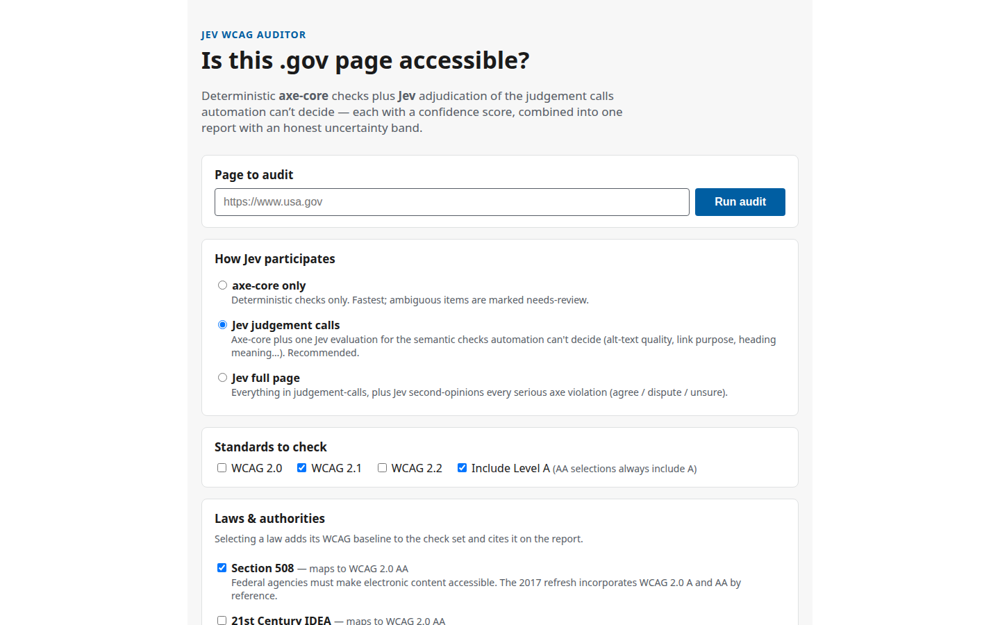
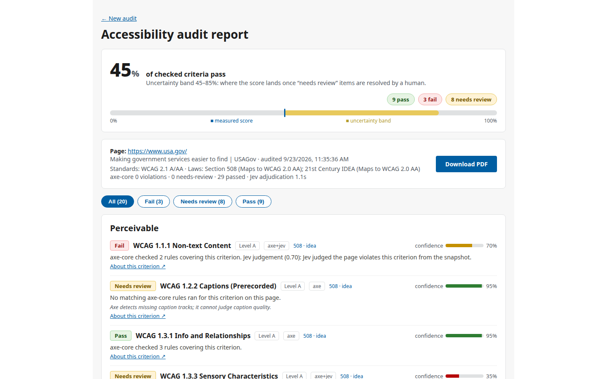
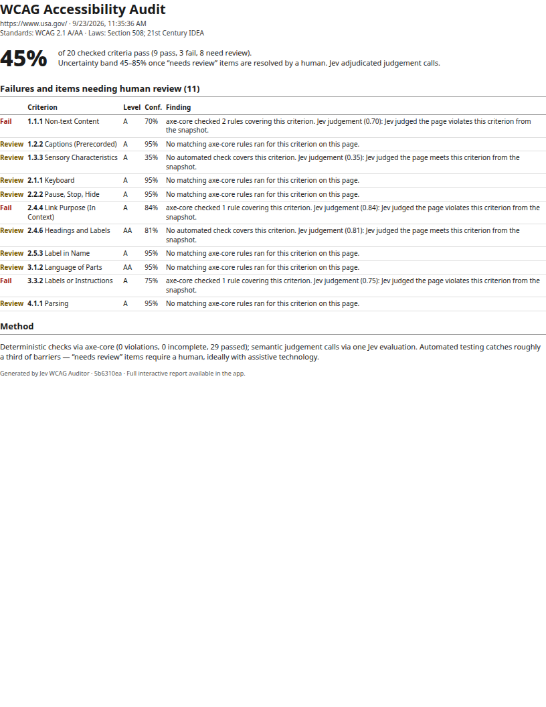

# Jev WCAG Auditor

Audit the WCAG compliance of a .gov page (or any public URL): deterministic
**axe-core** checks in headless Chromium, plus **Jev** adjudication of the
judgement calls automation can't decide — each finding confidence-scored,
combined into one interactive report with an honest uncertainty band, plus a
1–2 page downloadable PDF.

## How it works

1. **Enter a URL** and choose how Jev participates:
   - **axe-core only** — deterministic checks; ambiguous items land in "needs human review".
   - **Jev judgement calls** (recommended) — one Jev evaluation call over the page's semantic
     snapshot (headings, images + alt text, links, form labels, landmarks) answering six
     choice questions: alt-text meaningfulness (1.1.1), sensory characteristics (1.3.3),
     link purpose (2.4.4), heading descriptiveness (2.4.6), label descriptiveness (3.3.2),
     language match (3.1.1). Each returns pass / fail / needs-review with a confidence score.
   - **Jev full page** — everything above, plus Jev second-opinions each serious axe-core
     violation (agree → stands, dispute/unsure → needs human review, guarding against
     false positives).
2. **Toggle standards and laws.** WCAG 2.0 / 2.1 / 2.2, Level A and AA; laws map to their
   WCAG baselines and are cited on the report.
3. **Get the report.** Per-criterion verdicts grouped by POUR principle, each with basis
   (axe / jev / axe+jev), confidence, offending markup, and a link to the criterion.
   Aggregate score with an uncertainty band: the low end assumes every "needs review"
   item fails, the high end assumes they all pass.

## Screenshots







## Legal references

| Law | Baseline | Source |
|---|---|---|
| Section 508 (2017 refresh) | WCAG 2.0 A + AA (incorporated by reference) | access-board.gov/ict |
| 21st Century IDEA Act | via Section 508 → WCAG 2.0 AA | congress.gov (H.R.5759, 115th) |
| ADA Title II final rule (DOJ 2024) | WCAG 2.1 AA for state/local gov; 2026 IFR extended compliance dates (2027/2028); binds state/local, not federal sites | Federal Register 2024-07758 |
| OMB M-24-08 | no separate baseline; accessibility required via 508 + accessibility statements & manual testing | bidenwhitehouse.archives.gov/omb |

## Run it

```bash
npm install
npm run build
npm start   # http://localhost:3000
```

Audits shell out to `lib/jev_bridge.py` (`.venv/bin/python`), which authenticates
to TypeSafe via `TYPESAFE_API_KEY` or the stored `custom.typesafe` connector.
Headless Chromium drives the audited page; in sandboxed environments start the
proxy forwarder (`../jev-ultrafast/proxy_forwarder.py`) so Chromium can reach
the public web.

## Honesty notes

- Automated checks catch roughly a third of real accessibility barriers. "Needs human
  review" means exactly that — ideally testing with a screen reader.
- axe-core findings carry 0.95 confidence (deterministic, but page-state dependent);
  Jev findings carry Jev's reported confidence.
- Axe rules marked `wcag2a-obsolete` (e.g. duplicate-id under 4.1.1, removed in WCAG 2.2)
  are excluded when auditing against 2.2.

## Roadmap

See `future-feature.md` for the planned whole-domain crawl.
